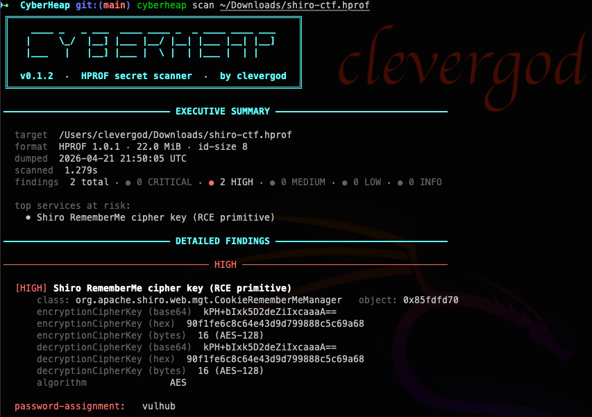

# CyberHeap

**Fast triage of Java heap dumps for pentesters.** Extract credentials, API
keys, tokens and private keys out of HPROF files in seconds — no JVM
required, no Eclipse MAT, no manual grepping.

```
 ____ _   _ ___  ____ ____ _  _ ____ ____ ___
|     \_/  |__] |___ |__/ |__| |___ |__| |__]
|___   |   |__] |___ |  \ |  | |___ |  | |
        HPROF secret scanner · by clevergod
```



Every run produces two blocks:

1. **Executive Summary** — target meta, severity tally, ranked risk
   highlights, top services at risk. Screenshot-friendly for the client.
2. **Detailed findings** — per-severity list with full class/object
   context, decoded JWT claims, and inline live-status badges.

Two scan passes feed both:

- **Regex pass** — ~40 tuned patterns across the raw bytes.
- **Structured pass** — parses HPROF, indexes every class and instance,
  pulls credentials directly out of Java objects (Spring
  `DataSourceProperties`, Hikari, Druid, Mongo, Shiro, Redis, Jasypt,
  cloud SDK credential classes, and user application beans via the
  heuristic `authn` spider).

---

## Features

- Single statically-linked Go binary. No JVM, no runtime deps.
- Scans local files **or** remote URLs (e.g. `/actuator/heapdump`).
- **Passive network validation** (DNS + TCP) of every URL/host
  discovered in the dump — labels each endpoint `LIVE` / `PUBLIC` /
  `INTERNAL` / `NXDOMAIN`.
- **JWT triage** — decodes claims, checks `exp`/`nbf`, labels tokens
  as `VALID` / `EXPIRED` offline.
- **Active credential validation** with `--verify-creds`:
  SaaS whoami (GitHub / OpenAI / Slack / Stripe / …) for vendor
  tokens, plus OAuth2 `client_credentials` / OIDC userinfo /
  HTTP Basic against endpoints discovered in the dump (public
  endpoints only, one attempt per credential).
- **Subdomain enumeration** — apex domains are **auto-derived** from
  every hostname discovered in findings (no flag needed). The scanner
  then harvests every matching hostname from heap strings, byte[] /
  char[] buffers (HTTP response bodies, serialization blobs,
  StringBuilder backings) and resolves each one. Use `--domain apex`
  to add extra apexes outside the finding set.
- **Default / weak credential tagging** — `admin/admin`, `root/root`,
  `tomcat/tomcat`, `postgres/postgres`, …  are tagged `[DEFAULT CREDS]`.
  Known-weak passwords (`password`, `qwerty`, `secret`, `Qwerty`,
  short <8 chars) get `[WEAK]`.
- **Severity policy**: `CRITICAL` is reserved for findings that are
  **proven live** — private keys with a full PEM block, validated
  SaaS tokens, OAuth2 flows that actually returned an `access_token`.
  Everything else caps at `HIGH`.
- Inline decoding of base64 basic-auth and JWT claims.
- Smart masking for client reports (`--mask`).
- Persistent JSON reports (`-o DIR`) with merge-on-rerun, `first_seen`
  / `last_seen` / `runs` per finding.
- Pretty terminal output, or `--format json` / `--format markdown`.

---

## Install

Requires Go 1.22+.

```sh
git clone https://github.com/cleverg0d/cyberheap.git
cd cyberheap
make build
./bin/cyberheap --help
```

Cross-compile:

```sh
GOOS=linux   GOARCH=amd64 go build -o cyberheap-linux-amd64  ./cmd/cyberheap
GOOS=linux   GOARCH=arm64 go build -o cyberheap-linux-arm64  ./cmd/cyberheap
GOOS=darwin  GOARCH=arm64 go build -o cyberheap-darwin-arm64 ./cmd/cyberheap
GOOS=windows GOARCH=amd64 go build -o cyberheap-windows.exe  ./cmd/cyberheap
```

---

## Commands

### `scan` — find and validate secrets in a dump

```sh
cyberheap scan <file.hprof | http(s)://host/path/heapdump>
```

Runs regex + structured passes, then (unless `--offline`) resolves every
discovered URL/host over DNS and probes TCP. JWTs get offline `exp`
parsing. With `--verify-creds`, credentials are actively validated
against the service that issued them.

| Flag | Purpose |
|------|---------|
| `--format f`          | `pretty` (default), `json`, `markdown` |
| `-o, --output DIR`    | Save/merge findings as JSON into `DIR/<target>.json` |
| `--severity a,b`      | Filter: `critical,high,medium,low,info` |
| `--category a,b`      | Filter: `datasource,credentials,cloud,scm,jwt,auth,connection-string,private-key,payment-saas,personal` |
| `--min-count N`       | Drop findings seen fewer than N times |
| `--mask`              | Mask secret values (for client-facing reports) |
| `-v, --verbose`       | Show byte offsets; render full PEM / JWT / long tokens unchopped |
| `--offline`           | Skip **all** network (no DNS, no TCP, no cred probes) |
| `--verify-creds`      | Actively validate each cred/token against its service (1 attempt, public endpoints only) |
| `--dns SERVER`        | DNS server for resolution (default `1.1.1.1`) |
| `--timeout DURATION`  | Per-lookup timeout for DNS/TCP/HTTP (default `5s`) |
| `--domain apex`       | Add apex domain(s) for subdomain enumeration. Auto-derived from finding hosts by default — only needed for apexes outside the dump's host set (repeatable, comma-separated) |
| `--diff-against FILE` | Compare against earlier JSON — tag findings `+` / `=` / `-` |

Respects the `NO_COLOR` environment variable. Advanced flags for pass
gating (`--no-regex`, `--no-spiders`, `--utf16`, `--no-header-check`,
`--patterns`, `--patterns-only`) are available but hidden from `--help`
to keep the surface minimal.

Auto-selected paths (no flag needed):

- Regex pass streams in 64 MiB chunks with 16 KiB overlap when the
  dump is ≥ 512 MiB.
- Structured pass mmap's the file zero-copy when the dump is
  ≥ 256 MiB local.

### `info` — dump metadata

```sh
cyberheap info <file.hprof>               # header only (instant)
cyberheap info <file.hprof> --deep        # full parse + class stats
cyberheap info <file.hprof> --deep --top=30
cyberheap info <file.hprof> --json
```

### `batch` — scan many dumps

```sh
cyberheap batch dumps/*.hprof -o ./reports --severity=critical,high
```

Per-file JSON reports + aggregate summary. `--fail-on-critical` exits
non-zero on any CRITICAL finding (CI-friendly).

### `decrypt` — offline cipher reversal

```sh
# Jasypt — ENC(...) strings
cyberheap decrypt jasypt --password=MASTER --value='ENC(...)'
cyberheap decrypt jasypt --from-dump=./heap.hprof --value='ENC(...)'

# Shiro RememberMe cookies
cyberheap decrypt shiro --key=<base64-16> --cookie=<b64> --mode=cbc
cyberheap decrypt shiro --auto --cookie=<b64>           # well-known keys
cyberheap decrypt shiro --from-dump=./heap.hprof --cookie=<b64>

# JWT decode + HMAC / RSA / ECDSA / EdDSA verification
cyberheap decrypt jwt --token=<jwt>                     # decode only
cyberheap decrypt jwt --token=<jwt> --secret=<HMAC>
cyberheap decrypt jwt --token=<jwt> --public-key FILE   # RS/ES/PS/EdDSA
```

Supported: **Jasypt 1.x** (PBKDF1-MD5/SHA1 with DES/3DES) + **3.x**
(PBKDF2 + AES), **Shiro** AES-CBC/GCM with well-known defaults,
**JWT** HS/RS/PS/ES/EdDSA. `alg:none` always rejected.

### `strings` — dump Java-resolvable strings

```sh
cyberheap strings FILE
cyberheap strings FILE --grep=password --unique
cyberheap strings FILE --regex='(?i)api[_-]?key'
cyberheap strings FILE --ascii --min-length=8
cyberheap strings FILE --scan                # run secret catalogue only over resolved strings
```

---

## Example run

> All sample values below are synthetic. Real client data never
> appears in this repository.

```
$ cyberheap scan ./heapdump
╔════════════════════════════════════════════════════╗
║  v0.1.3  ·  HPROF secret scanner  ·  by clevergod  ║
╚════════════════════════════════════════════════════╝

━━━━━━━━━━━━━━━━━━━━━━━━━━━━━━ EXECUTIVE SUMMARY ━━━━━━━━━━━━━━━━━━━━━━━━━━━━━━━

  target     ./heapdump
  format     HPROF 1.0.2 · 108.2 MiB · id-size 8
  dumped     2026-04-22 10:15:00 UTC
  scanned    6.1s
  findings   15 total · ● 0 CRITICAL · ● 10 HIGH · ● 2 MEDIUM · ● 3 LOW

    ● 1 default credentials  admin/admin @ TradeControlService
    ● 1 weak credentials  client:secret
    ● 2 live public endpoints  auth.example.com
    ● 2 expired tokens  http://kc.example.com/realms/master
    ● 2 internal-only endpoints  10.0.0.10
    ● 1 internal-only names (NXDOMAIN)  staging.example.com

  top services at risk:
    • App credentials: TradeControlService   default creds
    • App credentials: ApiClientService   live @ auth.example.com
    • Spring DataSourceProperties
    • Hikari connection pool config

━━━━━━━━━━━━━━━━━━━━━━━━━━ VERIFICATION (live status) ━━━━━━━━━━━━━━━━━━━━━━━━━━

  hosts  6 total   LIVE 2 · PUBLIC 1 · INTERNAL 2 · NXDOMAIN 1 · DNS-ERR 0

  [LIVE]      auth.example.com:443        203.0.113.10   tcp open
  [LIVE]      api.example.com:443         203.0.113.11   tcp open
  [PUBLIC]    legacy.example.com:10443    198.51.100.7   tcp refused
  [INTERNAL]  10.0.0.5:1433               10.0.0.5       tcp refused
  [INTERNAL]  10.0.0.10                   10.0.0.10
  [NXDOMAIN]  staging.example.com:443     (NXDOMAIN)

  subdomains  9 total   PUBLIC 5 · INTERNAL 0 · NXDOMAIN 4 · DNS-ERR 0

  [PUBLIC]    api.example.com                     203.0.113.11
  [PUBLIC]    auth.example.com                    203.0.113.10
  [PUBLIC]    mail.example.com                    203.0.113.12
  [NXDOMAIN]  kc.example.com
  [NXDOMAIN]  internal-test.example.com
  [NXDOMAIN]  staging.example.com

  jwts  2 total   VALID 0 · EXPIRED 2 · MALFORMED 0

━━━━━━━━━━━━━━━━━━━━━━━━━━━━━━ DETAILED FINDINGS ━━━━━━━━━━━━━━━━━━━━━━━━━━━━━━━

─────────────────────────────────── HIGH ───────────────────────────────────

  [HIGH] App credentials: ApiClientService
      class: com.acme.api.ApiClientService   object: 0xd71fb1f0
      clientId                app-prod
      clientSecret            ExampleSecret-deadbeef
      password                ExamplePass-01
      username                service@example.com

  [HIGH] App credentials: TradeControlService [DEFAULT CREDS]
      class: com.acme.tradecontrol.TradeControlService   object: 0xd6b66ae8
      tradeControlPassword    admin
      tradeControlUsername    admin

  [HIGH] Hikari connection pool config
      class: com.zaxxer.hikari.HikariDataSource   object: 0xd6299928
      jdbcUrl                 jdbc:sqlserver://10.0.0.5:1433;databaseName=appdb  → [INTERNAL] 10.0.0.5 tcp:1433 refused
      username                appsvc
      password                ExamplePassword-01

  jwt-token:  iss=http://kc.example.com/realms/master sub=service-account exp=2026-04-13 06:49:32Z  → [EXPIRED 9d ago]

─────────────────────────────────── MEDIUM ─────────────────────────────────

  basic-auth:  client:secret
  basic-auth:  svc-account:ExamplePass-01 (x24)

─────────────────────────────────── LOW ────────────────────────────────────

  email-address:  service@example.com (x14)
```

---

## Severity policy

| Level | When it fires |
|-------|---------------|
| **CRITICAL** | Full-body private key (RSA / EC / OPENSSH / PGP) captured with BEGIN + base64 + END; or a credential whose live validation returned 2xx (OAuth2 `access_token`, SaaS whoami 200, OIDC userinfo 200). |
| **HIGH** | Cleartext passwords / tokens / API keys / JDBC URLs / cloud credentials that were leaked but not actively validated. Default or weak passwords. |
| **MEDIUM** | Live public endpoints discovered in findings. Expired JWTs. Basic-auth with no further context. |
| **LOW** | Internal-only endpoints (RFC1918 / loopback). Emails. |
| **INFO** | Revoked tokens, NXDOMAIN hostnames, other dim signals. |

The rule "CRITICAL only after validation" protects you from overstating
risk in a client report: you never claim "critical" for a leak you
haven't proven exploitable.

---

## HPROF compatibility

- Format 1.0.1 and 1.0.2.
- 4-byte and 8-byte identifiers (auto-detected).
- JDK 8 `java.lang.String` (`char[] value`) and JDK 9+
  (`byte[] value` + `coder` for LATIN1 / UTF-16LE).
- Modified UTF-8 decoding for `STRING_IN_UTF8`.
- `HEAP_DUMP` and `HEAP_DUMP_SEGMENT` containers.
- Dotted field paths with object-reference traversal.

---

## Structured spiders (class-aware)

- **datasource** — Spring `DataSourceProperties`, Hikari, Druid, DBCP2,
  Tomcat JDBC, Weblogic, Mongo.
- **shiro** — `CookieRememberMeManager` (RCE primitive key).
- **propertysource** — Spring property maps; groups by dotted prefix so
  an OAuth block (`app.oauth.clientSecret` + `.clientId` + `.baseurl` +
  `.username`) travels together.
- **redis** — Spring Data Redis, Jedis, Lettuce.
- **env** — `java.lang.ProcessEnvironment` static fields.
- **jasypt** — master passwords fed into `decrypt jasypt --auto`.
- **cloudcreds** — AWS v1/v2, Aliyun OSS + Core SDK, Alibaba
  credentials-java, Huawei OBS, Tencent COS.
- **authn** — heuristic sweep for user-app beans (e.g. controllers and
  services) that carry `password` / `secret` / `token` fields. Skips
  JDK and framework namespaces already owned by dedicated spiders.

A finding is only reported when genuine credential evidence is present.
Findings are deduplicated across target classes so inheritance
hierarchies don't double-report the same object.

---

## Limitations

- HPROF 1.0.0 (pre-Java 5) is not supported.
- On actively-running Hikari pools, the password field is sometimes
  nulled after `pool.start()`. The real credential is kept in the
  adjacent `DataSourceProperties`, which CyberHeap reports correctly.
- `--verify-creds` sends one authentication attempt per discovered
  credential against public endpoints only. Aggressive lockout
  policies on the client side could still ban the account — this is
  the operator's responsibility to assess before enabling.

---

## Ethics

CyberHeap is intended for **authorised** penetration tests, red team
engagements, bug bounty programs, and incident response on systems you
own or have explicit permission to test. Exposed `/actuator/heapdump`
endpoints are a well-documented misconfiguration class; CyberHeap
automates triage once access is legitimate.

---

## Prior art

Class-aware extraction is inspired by
[JDumpSpider](https://github.com/whwlsfb/JDumpSpider) (Apache 2.0). The
HPROF parser, spider framework, regex catalogue, verification pipeline
and CLI are written from scratch in Go with a significantly expanded
target set.

---

## License

MIT — see [LICENSE](./LICENSE).

---

## Author

[@cleverg0d](https://github.com/cleverg0d) · [@securixy_kz](https://t.me/securixy_kz)
